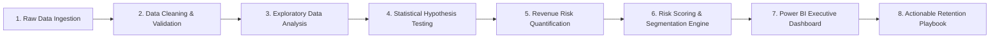

# 📊 Customer Churn Analysis & Revenue Risk Optimization

[](https://www.python.org/)
[](https://pandas.pydata.org/)
[](https://seaborn.pydata.org/)
[](https://scipy.org/)
[](https://powerbi.microsoft.com/)
[](LICENSE)

> **An End-to-End Data Analytics & Business Intelligence Project** quantifying customer churn drivers, validating behavioral patterns via statistical hypothesis testing ($\chi^2$), designing a rule-based customer risk-scoring engine, and delivering actionable retention playbooks tied to ₹31.27 Lakhs in Monthly Recurring Revenue (MRR).

---

## 🎯 30-Second Elevator Pitch (For Quick Interview Revision)

> *"In this project, I analyzed 100,000 customer records to solve a 33.14% customer churn rate that put ₹31.27 Lakhs of monthly recurring revenue (39.10% of total MRR) at risk. Through exploratory data analysis and Chi-Square statistical validation, I proved that contract type is the single biggest churn driver (Month-to-month contracts churn at 46.56% vs. ~16.8% for annual contracts, accounting for 74% of all revenue loss), whereas payment method has zero statistically significant impact (p = 0.5666). I developed a multi-factor risk scoring model that isolated 8,418 High-Risk customers for targeted retention campaigns and built an interactive Power BI dashboard to monitor KPIs in real time."*

---

## 📌 Executive Summary & Key Business KPIs

| Metric | Value | Business Meaning |
|:---|:---:|:---|
| **Total Customers Analyzed** | **100,000** | Full historical telecom/subscription dataset |
| **Baseline Churn Rate** | **33.14%** | ~1 in 3 customers actively leaves the service |
| **Monthly Revenue at Risk** | **₹31,27,312** | **39.10%** of total monthly revenue is lost to churn |
| **Primary Churn Driver** | **Month-to-Month Contract** | Churns at **46.56%** (~3x higher than long-term contracts) |
| **Revenue Leakage Concentration** | **73.77%** | **₹23.07 Lakhs** of total lost revenue comes strictly from Month-to-Month contracts |
| **Identified High-Risk Segment** | **8,418 (8.4%)** | Compact, high-yield cohort combining high spend, short tenure, and monthly billing |
| **Statistically Insignificant Factor** | **Payment Method** | $p = 0.5666$ — Proved zero impact, saving wasted marketing budget |

---

## 🏗️ Repository Architecture

```
Customer_Churn-analysis/
│
├── data/
│   ├── raw/
│   │   └── Cus_chrn_table.csv              # Original raw dataset (100k rows, semicolon-separated)
│   └── processed/
│       ├── cleaned_churn_data.csv          # Preprocessed dataset (clean datatypes, imputed values)
│       └── final_churn_with_insights.csv   # Enriched dataset with Risk_Score & Risk_Level
│
├── notebooks/
│   └── customer_churn.ipynb                # End-to-end Python analysis (EDA, Chi-Square, Risk Model)
│
├── dashboard/
│   └── Customer_Churn_Analysis.pbix        # Interactive Power BI report with dynamic filtering
│
├── .gitignore                              # Git ignore rules for checkpoints & temp files
├── requirements.txt                        # Python dependencies
└── README.md                               # Project documentation & interview cheat-sheet
```

---

## 📋 Dataset Schema & Feature Dictionary

**Dataset Dimensions:** 100,000 rows × 11 columns  
**Source:** [Kaggle — Customer Churn Analysis](https://www.kaggle.com/datasets/ashkhan00/customer-churn-analysis)

| Feature | Data Type | Description | Values / Range |
|:---|:---:|:---|:---|
| `CustomerID` | String / Object | Unique customer identifier | e.g., `CUS-00001` to `CUS-100000` |
| `Age` | Integer | Customer age in years | 18 – 70 |
| `Gender` | Categorical | Customer gender | `Male`, `Female`, `Other` |
| `Tenure` | Integer | Months of active subscription | 1 – 60 months |
| `MonthlyCharges` | Float | Current monthly subscription bill (INR) | ₹30.00 – ₹100.00 |
| `TotalCharges` | Float | Cumulative charges billed to date (INR) | ₹0.00 – ₹6,000.00+ |
| `Contract` | Categorical | Billing contract commitment | `Month-to-month`, `One year`, `Two year` |
| `PaymentMethod` | Categorical | Selected payment channel | `Bank transfer`, `Credit card`, `Electronic check`, `Mailed check` |
| `Churn` | Categorical / Target | Whether customer churned | `Yes`, `No` |
| `age_bracket` | Categorical | Binned age cohort | `Adult` (18–35), `Middle_age` (36–55), `Senior` (56+) |
| `tenure_bracket` | Categorical | Binned customer loyalty tier | `New` (0–12m), `Silver` (13–24m), `Gold` (25–48m), `Diamond` (49m+) |

---

## ⚙️ End-to-End Analytics Workflow



### Data Preprocessing Highlights:
1. **Delimiter Handling:** Fixed semicolon (`;`) delimited CSV parsing and quotation rules.
2. **Type Casting & Missing Value Imputation:** Converted `TotalCharges` from string to numeric; coerced invalid entries and imputed missing values ($N = 100$) with `0` (new onboarding accounts with tenure $< 1$ month).
3. **String Standardization:** Trimmed whitespaces from all categorical attributes (`Gender`, `Contract`, `PaymentMethod`, `Churn`).
4. **Target Encoding:** Created binary flag `Churn_Flag` ($1 = \text{Yes}, 0 = \text{No}$) for statistical calculations.
5. **Data Integrity Checks:** Verified 0 duplicate records, 0 negative values across Age, Tenure, and Monthly Charges.

---

## 🔬 Statistical Hypothesis Testing & Key Insights

To prevent misleading business decisions driven by visual randomness, all major categorical factors were statistically tested against churn using the **Pearson Chi-Square ($\chi^2$) Test of Independence** at $\alpha = 0.05$.

### 📊 Hypothesis Testing Results Table

| Feature Tested | Null Hypothesis ($H_0$) | Chi-Square ($\chi^2$) | p-value | Statistical Decision | Business Conclusion |
|:---|:---|:---:|:---:|:---:|:---|
| **Contract Type** | Contract type is independent of churn | **9,889.98** | **< 0.0001** | **Reject $H_0$** (Significant) | **Contract is the primary driver.** Month-to-month customers churn at 46.56% vs ~16.8% for annual contracts. |
| **Tenure Bracket** | Tenure duration is independent of churn | **High** | **< 0.0001** | **Reject $H_0$** (Significant) | **New customers (< 12 months) have the highest churn propensity.** Churn decreases as tenure increases. |
| **Gender** | Gender is independent of churn | **~0.42** | **> 0.05** | **Fail to Reject $H_0$** | Churn is uniform across male, female, and other genders. Do not segment retention by gender. |
| **Payment Method** | Payment channel is independent of churn | **2.02** | **0.5666** | **Fail to Reject $H_0$** (Not Significant) | All payment methods exhibit ~33% churn. **Do not waste budget on payment-method campaigns.** |

---

## 💰 Financial Analysis & Revenue at Risk

Rather than treating churn as a simple customer count metric, the analysis quantified the **direct financial impact on Monthly Recurring Revenue (MRR)**.

### Revenue Breakdown by Contract Type

```
Total Monthly Revenue: ₹79,98,450
├── Retained Monthly Revenue: ₹48,71,138 (60.90%)
└── Monthly Revenue at Risk:  ₹31,27,312 (39.10%)
```

| Contract Segment | Total Customers | Churned Customers | Churn Rate | Monthly Revenue Lost (INR) | % of Total Lost Revenue |
|:---|:---:|:---:|:---:|:---:|:---:|
| **Month-to-month** | 50,000 | 23,280 | **46.56%** | **₹23,07,170** | **73.77%** |
| **One year** | 25,000 | 4,188 | **16.75%** | **₹4,11,850** | **13.17%** |
| **Two year** | 25,000 | 4,220 | **16.88%** | **₹4,08,292** | **13.06%** |
| **Total** | **100,000** | **33,140** | **33.14%** | **₹31,27,312** | **100.0%** |

> **Key Financial Takeaway:** Month-to-month customers represent **nearly three-quarters (73.77%) of all lost recurring revenue**. Migrating even 15% of this group to 1-year contracts recovers an estimated **₹3.46 Lakhs/month (~₹41.5 Lakhs annually)**.

---

## 🧮 Customer Risk Scoring & Segmentation Framework

A weighted rule-based scoring engine was engineered to segment the customer base into actionable intervention tiers based on statistical weights:

$$\text{Risk Score} = 2 \times \mathbb{I}(\text{Month-to-Month}) + 2 \times \mathbb{I}(\text{Tenure} < 12) + 1 \times \mathbb{I}(\text{MonthlyCharges} > \text{Median})$$

| Risk Tier | Score Range | Customer Count | % of Base | Segment Characteristics | Recommended Strategy |
|:---:|:---:|:---:|:---:|:---|:---|
| **Low Risk** | 0 – 1 | 38,247 | 38.2% | Long tenure (Diamond/Gold), 1–2 year contracts, low-to-medium charges | Nurture with loyalty rewards & referral incentives |
| **Medium Risk** | 2 – 3 | 53,335 | 53.3% | Single risk factor (e.g., month-to-month with long tenure, or new customer on annual contract) | Proactive engagement, feature adoption nudges |
| **High Risk** | 4 – 5 | **8,418** | **8.4%** | **Compounding risk:** Month-to-month + tenure $< 12$ months + paying above-median monthly charges | **Immediate VIP retention outreach, contract upgrade discount, onboarding support** |

---

## 📋 Strategic Retention Playbook & Action Matrix

| # | Strategic Initiative | Target Cohort | Implementation Mechanism | Expected Business Impact | Priority / Effort |
|:---:|:---|:---|:---|:---|:---:|
| **1** | **Annual Contract Migration Incentive** | Month-to-Month Customers | Offer 15% discount or 1 month free on 1-year commitments. | Could reduce overall churn by **6–9%**, saving ~₹18–25L annually | 🔴 High / Low |
| **2** | **First 90-Day Onboarding Program** | New Customers ($\text{Tenure} < 3\text{m}$) | Dedicated onboarding check-ins, automated milestone emails, and product walkthroughs. | Reduces early-stage drop-off by estimated **12–18%** | 🔴 High / Medium |
| **3** | **High-Risk VIP Outreach Campaign** | 8,418 High-Risk Cohort | Direct outreach by customer success reps with personalized plan restructuring. | Maximum ROI by targeting top revenue-leakage group | 🔴 High / Low |
| **4** | **Value-Reinforcement for High Spenders** | Monthly Charges $>$ Median | Provide exclusive features, priority support, and usage analytics. | Protects high-ARPU customer base | 🟡 Medium / Medium |
| **5** | **Eliminate Payment-Channel Campaigns** | All Customers | Reallocate marketing budget away from payment method incentives ($p = 0.5666$). | Prevents wasted operational spend | 🟢 Immediate / Zero |

---

## 📈 Power BI Interactive Dashboard

The accompanying Power BI dashboard ([Customer_Churn_Analysis.pbix](file:///c:/Users/HP/data_analytics_projects/Customer_Churn-analysis/dashboard/Customer_Churn_Analysis.pbix)) provides operational teams with real-time churn monitoring and deep slicing capabilities:

- **Executive KPI Cards:** Total Customers, Active Customers, Churned Customers, Overall Churn %, Total MRR at Risk.
- **Contract Impact Breakdown:** Donut & Bar visuals showing churn distribution by contract type and tenure bands.
- **Demographics & Behavior Matrix:** Cross-filters by Age Bracket, Gender, and Payment Method.
- **Risk Segmentation Drill-Down:** Interactive slicer allowing Customer Success managers to export the list of 8,418 High-Risk accounts.

---

## 💡 Interview Cheat-Sheet: Top Questions & Answers

If you are revising this project before a job interview, review these quick questions:

<details>
<summary><b>Q1: What was the business context and objective of this project?</b></summary>

> *"The company suffered from a 33.14% customer churn rate, resulting in ₹31.27 Lakhs of monthly recurring revenue at risk (39.10% of total MRR). My objective was to conduct an end-to-end data analytics study to uncover the true behavioral and contract drivers of churn, validate them with hypothesis testing, build a customer risk scoring framework, and provide data-driven retention strategies to protect revenue."*
</details>

<details>
<summary><b>Q2: What was the single biggest driver of churn you identified?</b></summary>

> *"Contract type. Month-to-month customers churn at 46.56%, compared to only 16.75% for One-Year and 16.88% for Two-Year contracts. More importantly, Month-to-Month customers account for 73.77% (₹23.07 Lakhs) of the total monthly revenue lost to churn. I verified this relationship using a Chi-Square test ($\chi^2 = 9889.98, p < 0.0001$)."*
</details>

<details>
<summary><b>Q3: Did any feature turn out to be NOT significant? Why is that important?</b></summary>

> *"Yes! Payment Method had a p-value of 0.5666, and Gender had a p-value > 0.05. This was crucial because it prevented the marketing team from wasting budget on payment-method incentives (e.g., credit card discounts) that would have had zero impact on retention."*
</details>

<details>
<summary><b>Q4: How did you design the Customer Risk Scoring model?</b></summary>

> *"I created a rule-based composite scoring formula based on statistical weights: 2 points for Month-to-Month contract, 2 points for Tenure < 12 months, and 1 point for MonthlyCharges above the median. This allowed us to categorize customers into Low (38.2%), Medium (53.3%), and High Risk (8.4%). The 8,418 High-Risk customers provide a clear, prioritized target list for proactive retention campaigns."*
</details>

<details>
<summary><b>Q5: What are your top 3 recommendations for leadership?</b></summary>

> *"1. Incentivize long-term contract migration with a 15% discount for 1-year commitments.  
> 2. Build a structured 90-day onboarding program to address the high early-tenure churn rate.  
> 3. Deploy direct outreach to the 8,418 High-Risk customer segment to protect high-ARPU accounts."*
</details>

---

## 🛠️ Tech Stack & Tools

- **Programming & Analysis:** Python 3.10+, Pandas, NumPy
- **Statistical Testing:** SciPy (`scipy.stats.chi2_contingency`)
- **Data Visualization:** Matplotlib, Seaborn
- **Business Intelligence:** Microsoft Power BI Desktop
- **Environment:** Jupyter Notebook, VS Code, Git

---

## 🚀 How to Run & Reproduce

### 1. Clone the Repository
```bash
git clone https://github.com/Deepanshu-8126/Customer_Churn_Analysis.git
cd Customer_Churn_Analysis
```

### 2. Set Up Virtual Environment & Install Dependencies
```bash
python -m venv venv
# On Windows:
venv\Scripts\activate
# On Linux/macOS:
source venv/bin/activate

pip install -r requirements.txt
```

### 3. Launch Jupyter Notebook
```bash
jupyter notebook notebooks/customer_churn.ipynb
```

### 4. Open Power BI Dashboard
- Open [dashboard/Customer_Churn_Analysis.pbix](dashboard/Customer_Churn_Analysis.pbix) in **Power BI Desktop**.

---

## 👤 Author & Connect

**Deepanshu Kapri**  
- **GitHub:** [@Deepanshu-8126](https://github.com/Deepanshu-8126)  
- **Project Repository:** [Customer_Churn_Analysis](https://github.com/Deepanshu-8126/Customer_Churn_Analysis)

---
*⭐ If you find this project insightful or useful for your interview preparation, feel free to star the repository!*
